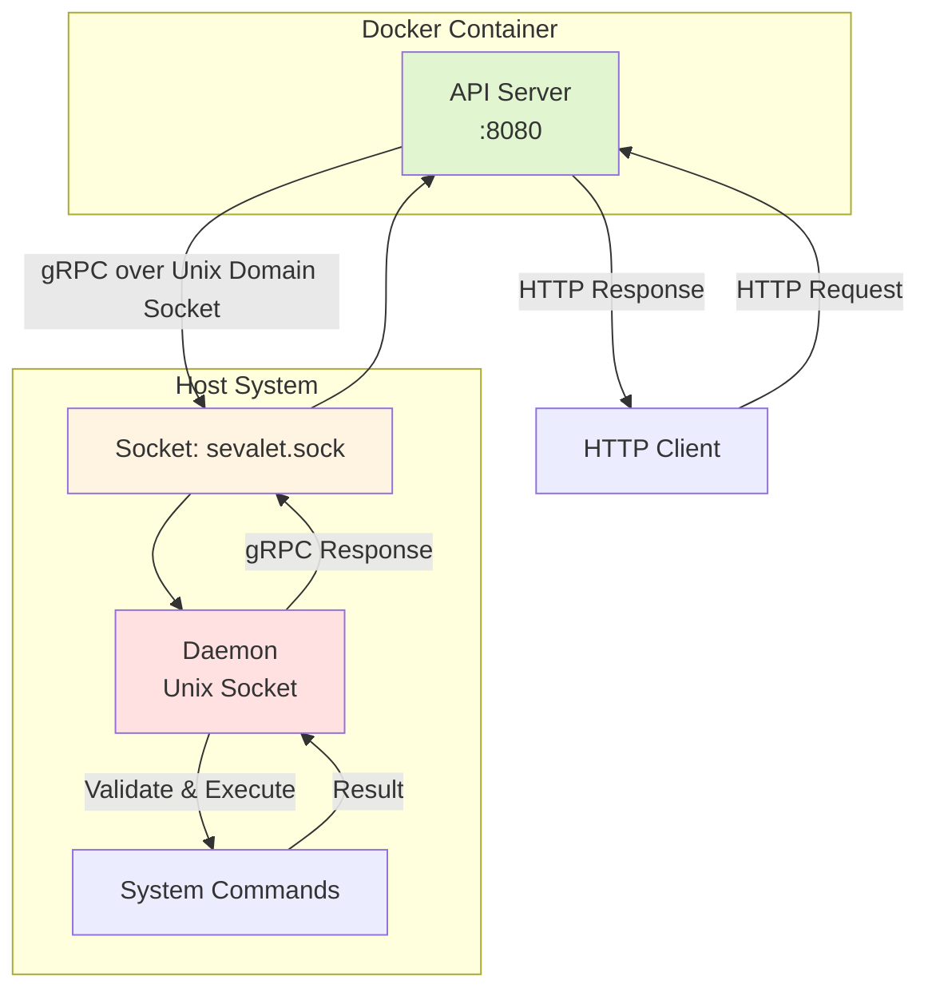

# Sevalet

Sevalet (Server valet) is a command execution service that exposes system commands through HTTP API, providing a alternative to SSH-based system integration.

## Motivation

SSH-based system integration, while simple to implement initially, often becomes a technical debt in the long term:

- SSH key management across multiple systems
- Difficult to monitor and audit command execution
- Complex error handling in distributed systems
- Tight coupling between systems

Sevalet solves these problems by providing:

- **HTTP API interface**: Standard REST API for command execution
- **Container-friendly architecture**: API server can run in containers while maintaining host command access
- **Clear separation of concerns**: HTTP interface and command execution are isolated components

## Architecture

Sevalet uses a two-tier architecture:



**Key Components:**

- **API Mode**: Runs in a Docker container without privileges, forwards HTTP requests to daemon
- **Daemon Mode**: Runs on the host system, validates and executes commands
- **Unix Domain Socket**: Local communication channel between API and daemon

This separation ensures that even if the API layer is compromised, attackers cannot directly execute commands on the host.

## Features

- **HTTP API for command execution**: RESTful interface for system integration
- **Container-compatible architecture**: Deploy API in containers while executing commands on host
- **Strict allow-list validation**: Only pre-configured commands and arguments can be executed
- **gRPC over Unix domain socket**: Efficient local communication between components
- **Structured JSON logging**: Comprehensive audit trail for all operations
- **Timeout enforcement**: Prevent runaway processes
- **Health check endpoints**: Integration with container orchestrators

## Prerequisites

- Protocol Buffers compiler (protoc)
- Docker (for container deployment)
- systemd (for daemon mode)

## Installation

```bash
$ go install github.com/zinrai/sevalet@latest
```

## Configuration

- Daemon Configuration (`configs/daemon.yaml`)
- API Configuration (`configs/api.yaml`)

## Usage

### Running the Daemon

Run with default config

```bash
$ sevalet daemon
```

Run with custom config and debug logging

```bash
$ sevalet daemon --config /path/to/daemon.yaml --log-level debug
```

Run with custom socket path

```bash
$ sevalet daemon --socket /tmp/sevalet.sock
```

### Running the API Server

Run with default config

```bash
$ sevalet api
```

Run with custom settings

```bash
$ sevalet api --listen :9090 --socket /var/run/sevalet.sock
```

### API Endpoints

Execute Command:

```bash
$ curl -X POST http://localhost:8080/execute \
    -H "Content-Type: application/json" \
    -d '{
      "command": "systemctl",
      "args": ["restart", "nginx"],
      "timeout": 30
    }'
```

Health Check:

```bash
$ curl http://localhost:8080/health
```

Readiness Check:

```bash
$ curl http://localhost:8080/ready
```

## Use Cases

- **CI/CD Integration**: Trigger deployments and service restarts via HTTP calls
- **Monitoring Systems**: Execute diagnostic commands from monitoring tools
- **Automation Platforms**: Integrate with workflow automation tools without SSH dependencies
- **Container Orchestration**: Manage host services from containerized control planes
- **Legacy System Integration**: Provide modern API access to traditional command-line tools

## Security Considerations

- **Command Allow-listing**: Only explicitly configured commands and arguments can be executed
- **Privilege Separation**: API server runs without privileges in a container, while the daemon runs on the host with minimal required privileges
- **No Command Enumeration**: The API does not expose available commands, reducing information disclosure
- **Unix Domain Socket**: Local-only communication between API and daemon with file permission controls
- **Audit Logging**: All command executions are logged with full details for compliance and troubleshooting

## Running Locally

Terminal 1: Start daemon

```bash
$ make run-daemon
```

Terminal 2: Start API server

```bash
$ make run-api
```

Terminal 3: Test request

```bash
$ curl -X POST http://localhost:8080/execute \
    -d '{"command":"uptime","args":[],"timeout":10}'
```

## License

This project is licensed under the [MIT License](./LICENSE).
